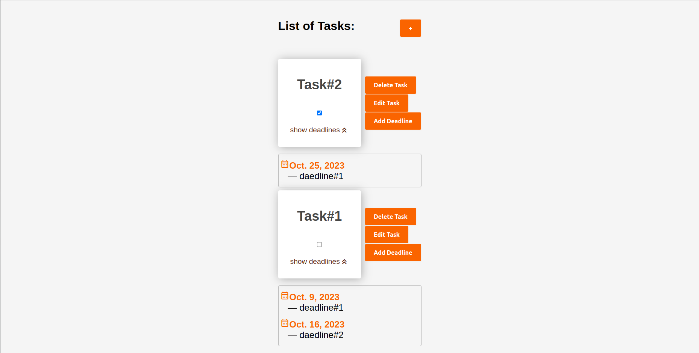

## Screenshot



## Technologies

Project is created with:

* Python: 3.10
* Django: 4.2.5

## Setup

* Create virtual environment:

```shell
python -m venv venv
```

* Activate virtual environment:

```shell
source venv/bin/activate
```

* Install the requirements:

```shell
pip install -r requirements.txt
```

* Create the database:

```shell
python manage.py makemigrations
python manage.py migrate
```

* Finally, run the development server:

```shell
python manage.py runserver
```